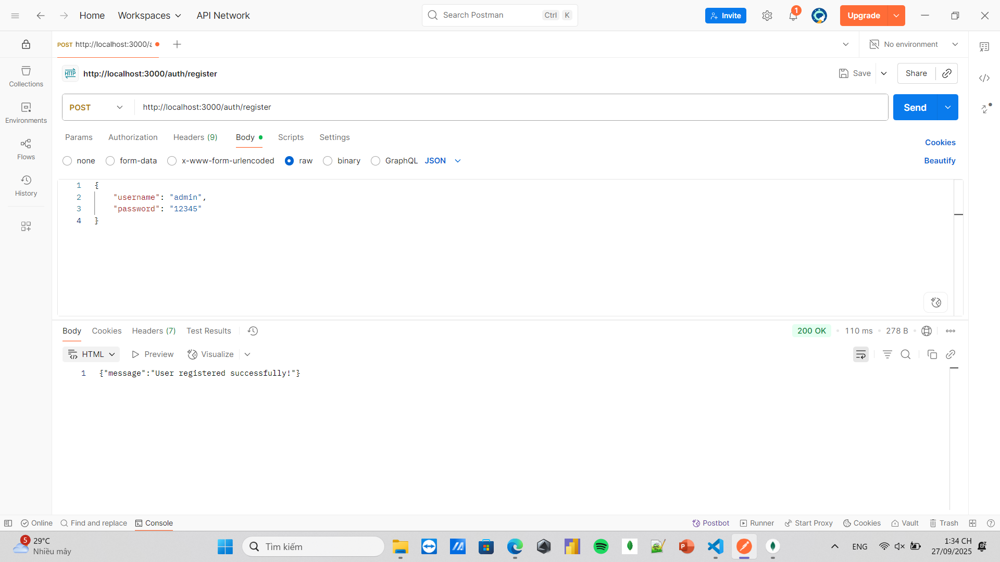
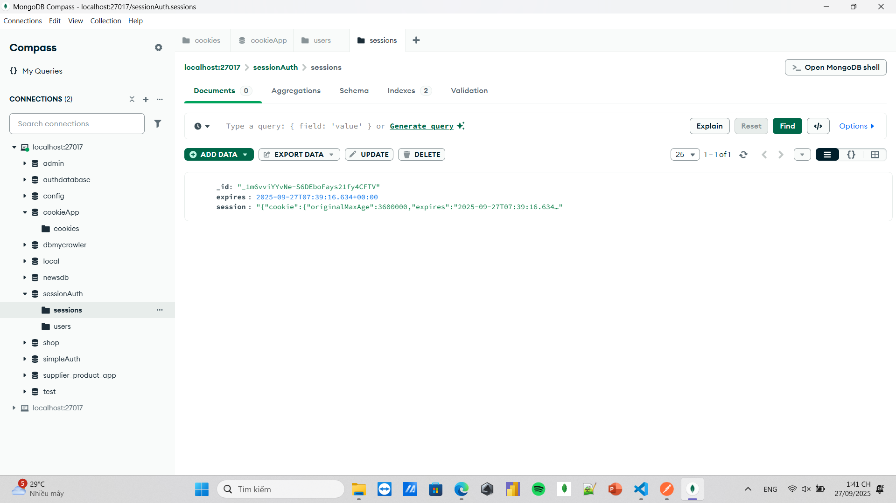
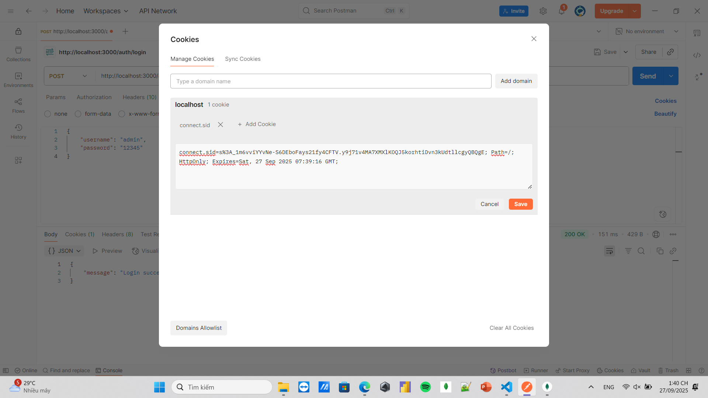
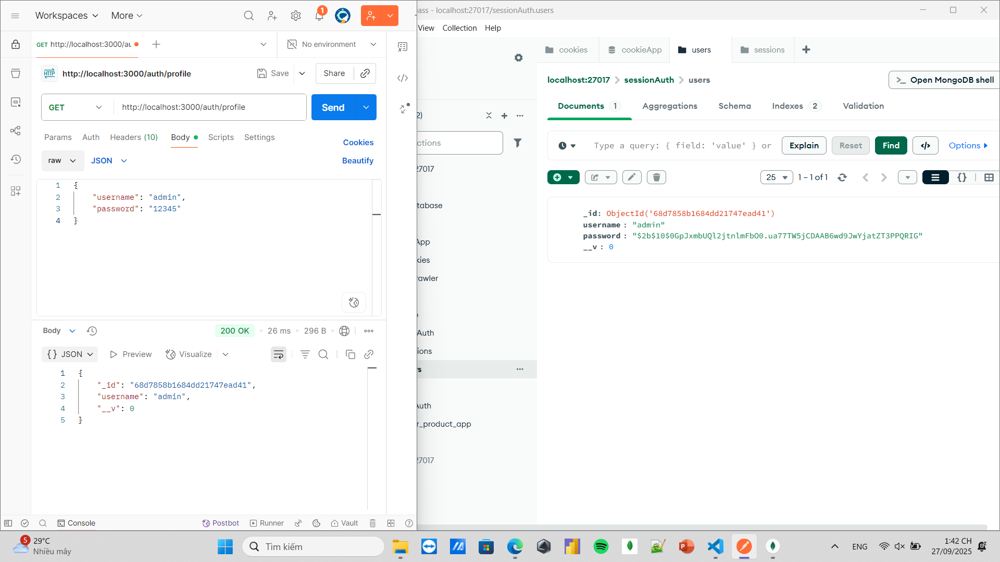
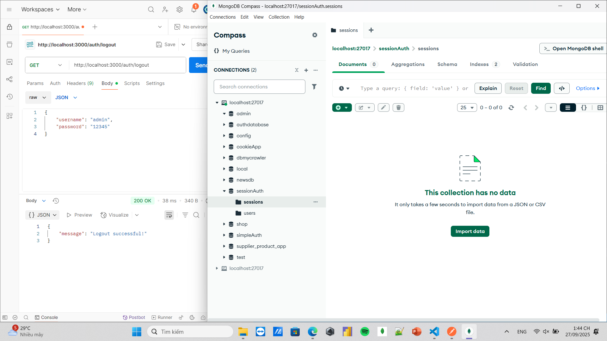

# 🍪 Cookie Session Auth

Ứng dụng **Authentication System** sử dụng **Node.js, Express, MongoDB** với cơ chế xác thực dựa trên **Session + Cookie**.  
Khác với `token_auth`, hệ thống này quản lý trạng thái người dùng bằng **express-session** thay vì JWT.

---

## 🚀 Công nghệ sử dụng
- **Node.js + Express.js** – Backend framework
- **MongoDB + Mongoose** – Database & ODM
- **Express-session** – Quản lý session trên server
- **Bcrypt.js** – Hash mật khẩu

---

## 📂 Cấu trúc thư mục

```bash
cookie_session_auth/
│── models/
│ └── userModel.js
│── routes/
│ └── authRoutes.js
│── public/
│ └── results/ (chứa ảnh minh họa)
│── app.js
│── package.json
│── package-lock.json
│── .gitignore
│── README.md
```

## ▶️ Cách chạy
```bash
# 1. Clone repo
git clone https://github.com/your-username/cookie_session_auth.git
cd cookie_session_auth

# 2. Cài dependencies
npm install

# 3. Chạy server
npm start
```

Server sẽ chạy tại: http://localhost:3000

## 🔑 Tính năng chính

✅ Đăng ký tài khoản (hash mật khẩu bằng bcrypt)

✅ Đăng nhập tài khoản (tạo session và lưu sessionID trong cookie)

✅ Bảo vệ route bằng middleware kiểm tra session

✅ Người dùng có thể đăng xuất (xoá session trên server + cookie trên client)

## 🖼️ Ảnh minh họa
## Đăng ký


## Đăng nhập



## Xem profile


## Đăng xuất

